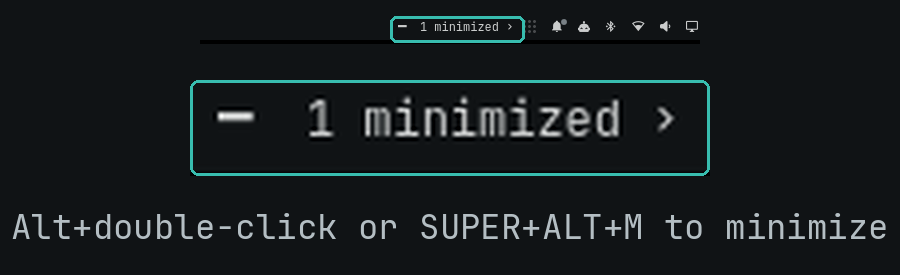

# Omarchy Minimized

Minimize windows on Omarchy/Hyprland — Wayland has no native minimize, so this
plugin emulates it by parking windows on a dedicated `special:minimized`
workspace and restoring them to their original workspace on demand.

It is a **dual-kind plugin**: a resident service owns the state machine, IPC,
and keybinds, while an optional bar widget shows the minimized windows and
restores them with a click. The keybinds keep working even if the widget is
not on the bar.

## Triggers

| Action | How |
| --- | --- |
| Minimize active window | `SUPER + ALT + M` |
| Restore last minimized | `SUPER + ALT + R` |
| Minimize window under cursor | `ALT` + double left-click on the window |
| Restore a specific window | Click the bar widget, pick the window |

The Alt+double-click bind is `non_consuming`, so the click still reaches the
application — the plugin only watches it.

## How it works

- `SUPER+ALT+M` (or the widget menu) moves the focused window to
  `special:minimized` and records its origin workspace in
  `~/.local/state/omarchy-modes/state.json`.
- Restoring moves it back to the recorded workspace. If a parked window has no
  recorded origin (state loss, manual move), it restores to your current
  workspace instead of staying stranded.
- Every move is **verified** after dispatch: Hyprland reports `ok` even when a
  move did not happen, so the service re-queries `hyprctl clients` and confirms
  the window actually landed before touching state.
- State is pruned against live clients: closing a window or dragging it out of
  the minimized workspace by hand removes its entry automatically.

Keybinds live in a generated drop-in at
`~/.local/state/omarchy/toggles/hypr/omarchy-minimized.lua`, gated on the
plugin still being enabled, and are removed when the plugin is disabled or
uninstalled.

## Lifecycle

- **Disable / remove**: the drop-in is deleted, Hyprland reloads, and any
  windows still parked on `special:minimized` are restored to their recorded
  workspaces (falling back to the active workspace).
- **Shell restart**: minimized windows stay parked — the cleanup only runs the
  restore sweep when the plugin is no longer enabled in `shell.json`.
- `state.json` is user data and is never deleted on remove.

## Dependencies

Stock Omarchy only: `hyprctl`, `qs`, `jq`, `notify-send`.

## Compatibility

Built and tested on Omarchy 4.0.4 / Hyprland 0.56.2. Shares
`~/.local/state/omarchy-modes/state.json` with
[omarchy-modes-switcher](https://github.com/v3moreno/omarchy-modes-switcher)
(the `modes` and `minimized` keys are independent).

## License

MIT — see [LICENSE](LICENSE).
